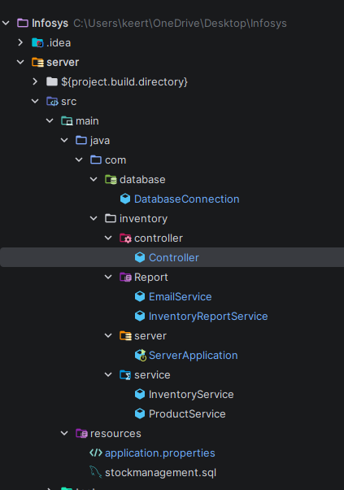

## Try to commit files in main branch not in master branch.

## File format
Infosys/
root
README.md
— setup instructions for teammates
server/
src/
main/
java/com/
database/
DB layer
DatabaseConnection.java
— opens MySQL connection
inventory/
business layer
controller/
Controller.java
— delegates all operations
Report/
alert layer
EmailService.java
— Gmail SMTP sender
InventoryReportService.java
— low stock checker
server/
ServerApplication.java
— Spring Boot entry point
service/
InventoryService.java
— update stock logic
ProductService.java
— add product logic
resources/
application.properties
— DB url, credentials, Spring config
stockmanagement.sql
— database dump for teammates



## Database setup 
Click on  stockmanagement.sql from resources folder and run it in sqlWorkbench you will have database exactly what I had.

## Email Setup
1. Use a personal Gmail account as the sender
2. Enable 2-Step Verification on that Gmail
3. Go to myaccount.google.com → search App Passwords → generate one
4. Open `EmailService.java` and update:
```java
private final String username = "yourpersonal@gmail.com";
private final String password = "your-16-char-app-password-load-it-without-any-spaces";
```
5. Set your receiver email in `InventoryReportService.java`

## How to Run

1. Complete Database Setup and Email Setup above
2. Open the project in IntelliJ
3. Run `ServerApplication.java`
4. Check the console — low stock products will be listed
5. Check your inbox — alert email will arrive automatically