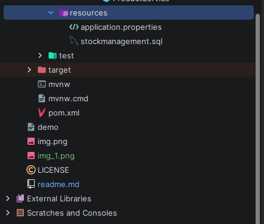

## Try to commit files in main branch not in master branch.

## File format



## Project Overview
This is Business Layer of Inventory Management and Reporting System.
Here we have implemented the business logic i.e, performing CRUD operations such as creating new products, updating existing products, removing products, generaitng low stock.

## Project inventory packages
# Controller

# DAO

# Model

# Report
This package has email service which configures SMTP and authenticates using email and app password.
This package also has InventoryReportService which sends email when the quantity of any product in the database is less then its mininum quantity and this operations can be called only when we reduce any product from inventory.
The email has:
1. sender mail
2. receiver mail
3. subject
4. body

# Server

# Service
 
## Database setup 
Click on  stockmanagement.sql from resources folder and run it in sqlWorkbench you will have database exactly what I had.

## Email Setup
1. Use a personal Gmail account as the sender
2. Enable 2-Step Verification on that Gmail
3. Go to myaccount.google.com → search App Passwords → generate one
4. Open `EmailService.java` and update:
```java
private final String username = "yourpersonal@gmail.com";
private final String password = "your-16-char-app-password-load-it-without-any-spaces";
```
5. Set your receiver email in `InventoryReportService.java`

## How to Run

1. Complete Database Setup and Email Setup above
2. Open the project in IntelliJ
3. Run `ServerApplication.java`
4. Check the console — low stock products will be listed
5. Check your inbox — alert email will arrive automatically

## How to set up postman and send requests to controller

1. Downloading postman
```angular2html
https://www.postman.com/downloads/
```
2. Create you profile and login.
3. Create your own workspace.

# Operations on postman
1. Create - add new product
select method: POST
URL: http://localhost:8080/api/product
Click on body and Paste the given code and send it
```
{ "name": "product name", "price": ?, "stock": ?, "category": "?" }
```
Expected: Product added

2. Read - get all the products
select method: GEt
paste the url beside the method you have selected
URL: http://localhost:8080/api/products
Click on send
Expected: all the products list in json

3. Read - get one product by id
select method: GET
URL: http://localhost:8080/api/product/product_id
click on send 
Expected: single product which has been searched

4. Update - reduce stock
select method: POST
URL: http://localhost:8080/api/reduce/product_id/quantity_to_be_reduced
click on send 
Expected: stock reduced and report will be sent for products which are less the minimum quantity

5. Update - increase stock
select method: POST
URL: http://localhost:8080/api/increase/product_id/quantity_to_be_added
click on send 
Expected: stock increased

6. Delete - removes the product
select method: DELETE
URL: http://localhost:8080/api/product/product_id
click on send
Expected: stock deleted


